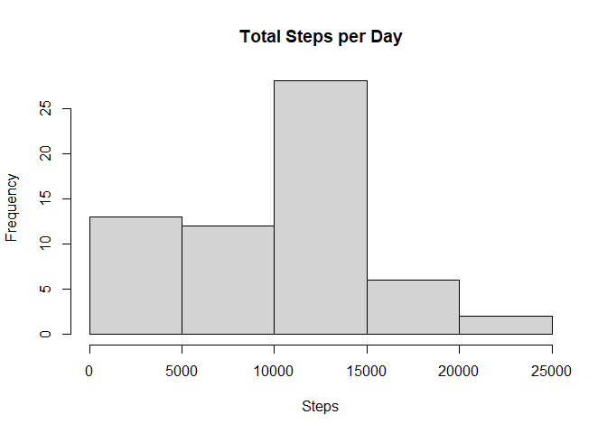
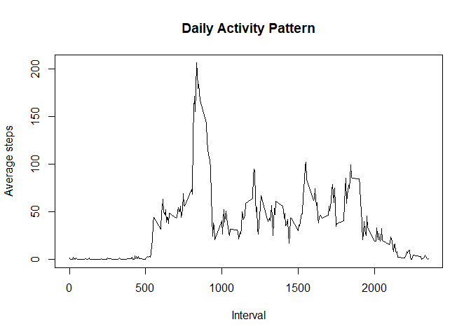
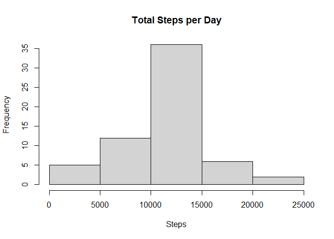
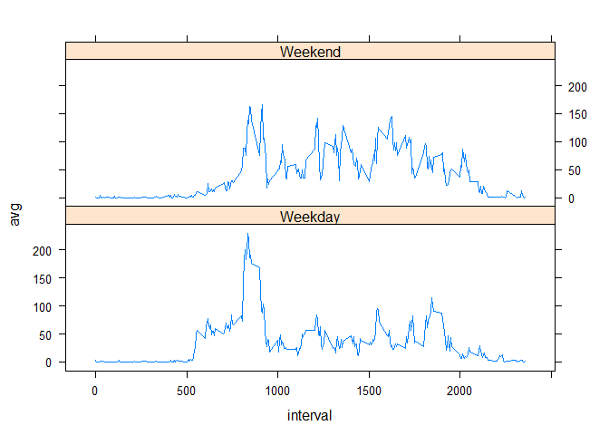

## Load and preprocess the data

1. Load the data

```r
## loads packages
library(dplyr)
library(lattice)
library(knitr)
```


```r
##  data file is stored in the working directory

steps <- read.csv(unz("activity.zip", "activity.csv"))
##steps <- read.csv("activity.csv")
```


```r
## view properties of dataset
str(steps)
```

```
## 'data.frame':	17568 obs. of  3 variables:
##  $ steps   : int  NA NA NA NA NA NA NA NA NA NA ...
##  $ date    : chr  "2012-10-01" "2012-10-01" "2012-10-01" "2012-10-01" ...
##  $ interval: int  0 5 10 15 20 25 30 35 40 45 ...
```

2. Transform the data 

```r
## converts date variable to date class
steps$date <- as.Date(steps$date, "%Y-%m-%d")
```


## What is mean total number of steps taken per day?

For this part of the assignment, the missing values in the dataset are ignored.

1. Calculate the total number of steps taken per day

```r
## uses dplr package to calculate and summarize total daily steps
stepsdailytotal <-
  steps %>% 
  group_by(date) %>%        
  summarize(total= sum(steps, na.rm = TRUE))

head(stepsdailytotal)
```

```
## # A tibble: 6 x 2
##   date       total
##   <date>     <int>
## 1 2012-10-01     0
## 2 2012-10-02   126
## 3 2012-10-03 11352
## 4 2012-10-04 12116
## 5 2012-10-05 13294
## 6 2012-10-06 15420
```


2. Make a histogram of the total number of steps taken each day

```r
## histogram of total steps per day 
hist(stepsdailytotal$total,
     xlab = "Steps",
     main = "Total Steps per Day")
```

<!-- -->

3. The mean and median of the total number of steps taken per day


```r
paste("Mean is ", round(mean(stepsdailytotal$total, na.rm = TRUE), 0)) 
```

```
## [1] "Mean is  9354"
```

```r
paste("Median is ", round(median(stepsdailytotal$total, na.rm = TRUE), 0)) 
```

```
## [1] "Median is  10395"
```


## What is the average daily activity pattern?

1. A time series plot of the 5-minute interval (x-axis) and the average number of steps taken, averaged across all days (y-axis).


```r
## calculates averages
pattern <-
  steps %>% 
  group_by(interval) %>%        
  summarize(avg= mean(steps, na.rm = TRUE))
```


```r
head(pattern)
```

```
## # A tibble: 6 x 2
##   interval    avg
##      <int>  <dbl>
## 1        0 1.72  
## 2        5 0.340 
## 3       10 0.132 
## 4       15 0.151 
## 5       20 0.0755
## 6       25 2.09
```


```r
## plots averages
plot(pattern$interval,
     pattern$avg, 
     type="l", 
     ylab = "Average steps",
     xlab = "Interval",
     main = "Daily Activity Pattern" )
```

<!-- -->

2. The 5-minute interval, on average across all the days in the dataset, that contains the maximum number of steps.


```r
paste("Interval ", 
      pattern$interval[pattern$avg==max(pattern$avg)], 
      " contains the maximum number of steps") 
```

```
## [1] "Interval  835  contains the maximum number of steps"
```

## Imputing missing values

1. The total number of missing values in the dataset (i.e. the total number of rows with \color{red}{\verb|NA|}NAs) is 2304.


```r
colSums(is.na(steps))
```

```
##    steps     date interval 
##     2304        0        0
```

2. Strategy for filling in all of the missing values in the dataset is to impute the mean for that 5-minute interval.

Subset missing values


```r
## subsets rows with missing steps value
missing <- is.na(steps$steps)
missingsubset <- steps[missing,]
```


```r
## confirms only NAs are subsetted
head(missingsubset)
```

```
##   steps       date interval
## 1    NA 2012-10-01        0
## 2    NA 2012-10-01        5
## 3    NA 2012-10-01       10
## 4    NA 2012-10-01       15
## 5    NA 2012-10-01       20
## 6    NA 2012-10-01       25
```

```r
tail(missingsubset)
```

```
##       steps       date interval
## 17563    NA 2012-11-30     2330
## 17564    NA 2012-11-30     2335
## 17565    NA 2012-11-30     2340
## 17566    NA 2012-11-30     2345
## 17567    NA 2012-11-30     2350
## 17568    NA 2012-11-30     2355
```


Replace missing values with interval average


```r
## replaces missing values with  average calculated in Section 3 
for (i in 1:length(missingsubset$steps))  {
  missingsubset[i,1] <- pattern$avg[pattern$interval==missingsubset$interval[i]]
  }
```


```r
str(missingsubset)
```

```
## 'data.frame':	2304 obs. of  3 variables:
##  $ steps   : num  1.717 0.3396 0.1321 0.1509 0.0755 ...
##  $ date    : Date, format: "2012-10-01" "2012-10-01" ...
##  $ interval: int  0 5 10 15 20 25 30 35 40 45 ...
```


```r
## confirms no missing data in subset
colSums(is.na(missingsubset))
```

```
##    steps     date interval 
##        0        0        0
```

3. Creates a new dataset that is equal to the original dataset but with the missing data filled in


```r
## creates copy of original dataset and inserts missing values
stepsimputed <- steps
stepsimputed[missing,] <- missingsubset
```


```r
## confirms no missing values
colSums(is.na(stepsimputed))
```

```
##    steps     date interval 
##        0        0        0
```

4. Histogram of the total number of steps taken each day


```r
## recalculates daily total with imputed missing values 

stepsfilled <-
  stepsimputed %>% 
  group_by(date) %>%        
  summarize(total= sum(steps, na.rm = TRUE))
```


```r
## plots data with imputed values included
hist(stepsfilled$total, 
     xlab = "Steps",
     main = "Total Steps per Day")
```

<!-- -->

The mean and median total number of steps taken per day


```r
paste("Mean is ", round(mean(stepsfilled$total), 0)) 
```

```
## [1] "Mean is  10766"
```

```r
paste("Median is ", round(median(stepsfilled$total),0)) 
```

```
## [1] "Median is  10766"
```


Median and mean are now identical and both values are higher than the previous estimates. 


## Are there differences in activity patterns between weekdays and weekends?

Dataset with the filled-in missing values is used for this part.

Create a new factor variable in the dataset with two levels – “weekday” and “weekend” indicating whether a given date is a weekday or weekend day.


```r
stepsimputed$day <- weekdays(steps$date)
stepsimputed$dayfac <- "Weekday"
weekendInd <- which(stepsimputed$day=="Saturday" |  stepsimputed$day =="Sunday")
stepsimputed$dayfac[weekendInd] <- "Weekend"
```

Panel plot containing a time series plot of the 5-minute interval (x-axis) and the average number of steps taken, averaged across all weekday days or weekend days (y-axis). 


```r
stepsdays <-
  stepsimputed %>% 
  group_by(dayfac, interval) %>% 
  summarize(avg= mean(steps, na.rm = TRUE))
```


```r
xyplot(avg ~ interval | dayfac, 
       data = stepsdays, 
       layout = c(1, 2),
       type="l")
```

<!-- -->


